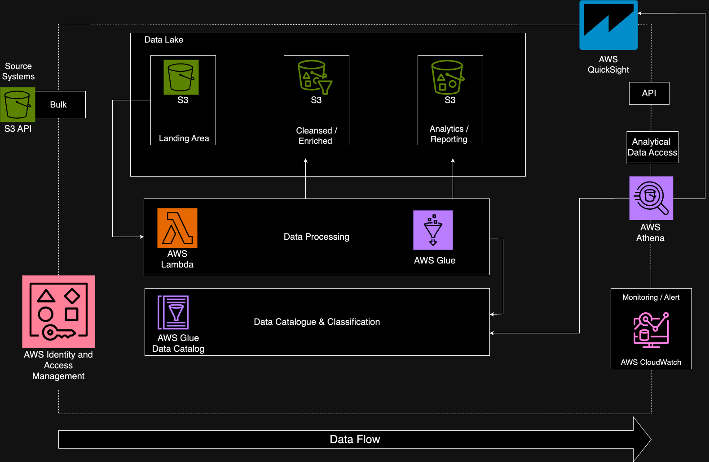
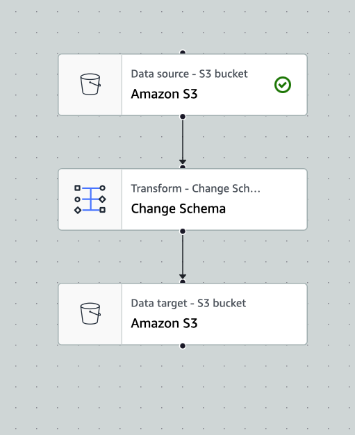
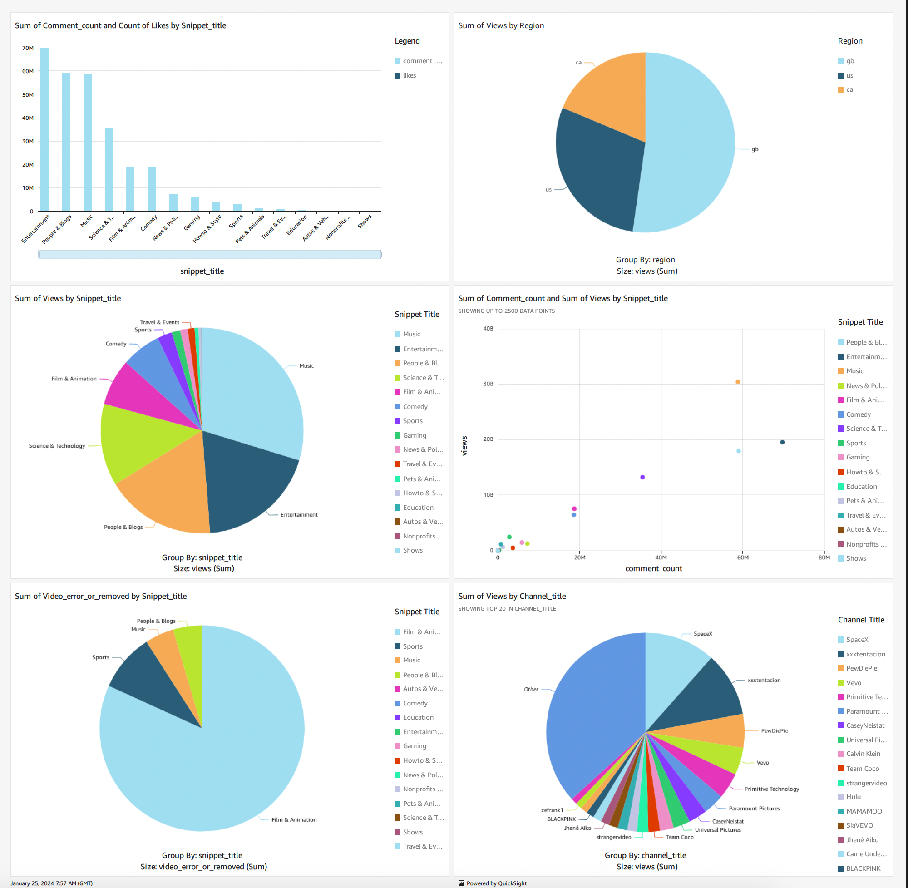

# Data-Engineering End to End youtube data Analysis

## Overview
This project goals are to streamline youTube data from difference source and perform securely manage end to end data analysis on structured and semi-structure YouTube data using AWS service

## Dataset Used
The dataset contains CSV statistics from daily popular YouTube videos over the course of many months. The video data set include title, channel title, publication time, tags, views, likes and dislikes, description ... 

    ("video_id"),
    ("trending_date"),
    ("title"),
    ("channel_title"),
    ("category_id"),
    ("publish_time"),
    ("tags"),
    ("views"),
    ("likes"),
    ("dislikes"),
    ("comment_count"),
    ("thumbnail_link"),
    ("comments_disabled"),
    ("ratings_disabled"),
    ("video_error_or_removed"),
    ("description", "string"),
The data set is splite base on region and analysis is done base on region selection and overall 

[https://www.kaggle.com/datasets/datasnaek/youtube-new](https://www.kaggle.com/datasets/datasnaek/youtube-new)

## Project Goals
1. Data Ingestion — Build a mechanism to ingest data from different sources
2. Data lake — Create data lake to store all structred and semi-structure data 
3. Automation - Create event driven to automate data preparation and cleansing 
4. Scalability — Scale up and down base data size processing and system requirement 
5. Cloud — I used AWS cloud service 
6. Reporting — Build a dashboard for data visualization and analysis 

## Service we will be using
1. Amazon Simple Storage Service (Amazon S3) is an object storage service offering industry-leading scalability, data availability, security, and performance. Customers of all sizes and industries can store and protect any amount of data for virtually any use case, such as data lakes, cloud-native applications, and mobile apps.

2. AWS IAM: AWS Identity and Access Management (IAM) is a web service that helps you securely control access to AWS resources. With IAM, you can centrally manage permissions that control which AWS resources users can access. You use IAM to control who is authenticated (signed in) and authorized (has permissions) to use resources.

3. QuickSight: AAmazon QuickSight powers data-driven organizations with unified business intelligence (BI) at hyperscale. With QuickSight, all users can meet varying analytic needs from the same source of truth through modern interactive dashboards, paginated reports, embedded analytics, and natural language queries.

4. AWS Glue: AWS Glue is a serverless data integration service that makes it easier to discover, prepare, move, and integrate data from multiple sources for analytics, machine learning (ML), and application development.

5. AWS Lambda: AWS Lambda is a compute service that runs your code in response to events and automatically manages the compute resources, making it the fastest way to turn an idea into a modern, production, serverless applications.

6. AWS Athena: Amazon Athena is a serverless, interactive analytics service built on open-source frameworks, supporting open-table and file formats. Athena provides a simplified, flexible way to analyze petabytes of data where it lives.

## Architecture Diagram

## Sample GluETL Diagram

## QuickSight Dashboard

